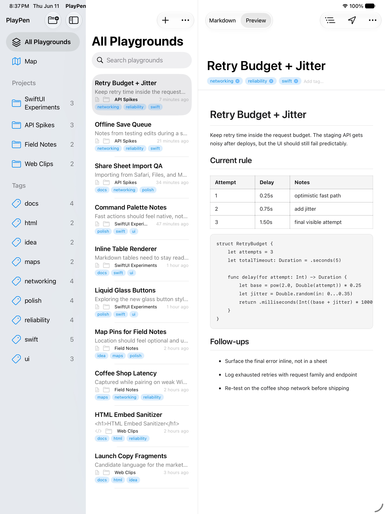
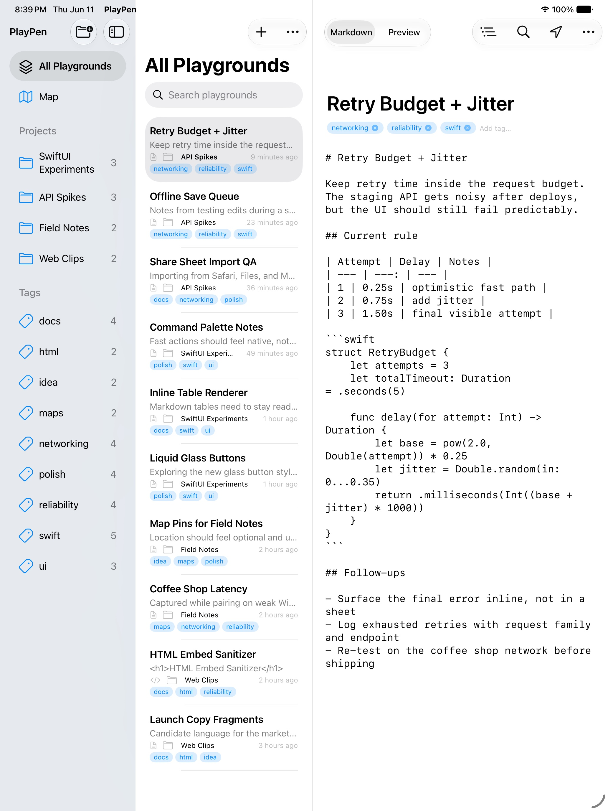

# PlayPen

PlayPen is open-source agent artifact infrastructure: a native Mac/iPad editor plus a hosted mirror service for HTML and Markdown playgrounds.

AI agents and humans often produce useful artifacts that disappear into chat transcripts, local temp folders, or screenshots. PlayPen gives those artifacts a durable shape:

- agents can publish HTML or Markdown to a hosted link
- users can open the same link in any browser
- reviewers can inspect metadata, raw source, and content digests
- the native app can import, edit, sync, and republish the hosted record
- deployment tooling can verify a host before anyone trusts its links

The native app is intentionally becoming the local mirror/editor for the hosted service, not the only place a playground can live.

## Status

Current maturity: working prototype / submission candidate.

Local MVP stopping point: the repo is submission-ready when the hosted Node API,
static fallback, CLI publish/inspect/verify flow, native mirror import/sync
flow, and local verification commands all pass without a public deployment. A
real public host is the next gate, not something this repo should silently do.

Working now:

- Native SwiftUI app for macOS and iPadOS 27 targets
- Markdown and HTML playground editing/preview
- Hosted mirror metadata on local playgrounds
- `playpen://import` and `playpen://configure` deep links
- Hosted library browser in the native app
- Static hosted viewer with `#playground=` fallback links
- Node hosted service with short `/p/:id` records
- Filesystem storage by default
- S3-compatible storage support for durable object storage
- OpenAPI contract, CLI publishing, verifier, and production preflight

Still required before calling the hosted goal complete:

- approved public deployment target
- real public URL verification with `npm run preflight -- --require-public`
- production signing/team configuration for native distribution

No public deployment has been attempted from this repository without explicit approval and a named target.

## Screenshots

Current screenshots live under [PlayPen/Marketing/screenshots](PlayPen/Marketing/screenshots). They are useful demo placeholders until a fresh submission capture pass is run.





## Repository Layout

- [PlayPen](PlayPen): native SwiftUI app and XcodeGen project
- [PlayPen/Hosted](PlayPen/Hosted): hosted mirror web app, API, CLI, verifier, and storage adapters
- [PlayPen/Marketing](PlayPen/Marketing): marketing/demo assets
- [docs](docs): demo and deployment checklists
- [MVP readiness audit](docs/MVP_READINESS.md): submission stopping point and remaining public-host gate
- [PLAN.md](PLAN.md): implementation plan and remaining production steps
- [OPENAI_SUBMISSION.md](OPENAI_SUBMISSION.md): one-page submission narrative
- [AGENTS.md](AGENTS.md): agent-facing repo contract and verification commands

## Native App Quick Start

Requirements:

- Xcode beta with macOS/iOS/iPadOS 27 SDKs
- XcodeGen

```sh
cd PlayPen
xcodegen
xcodebuild -project PlayPen.xcodeproj \
  -scheme PlayPen \
  -destination 'platform=iOS Simulator,name=iPad Pro 13-inch (M5),OS=27.0' \
  build
```

Open `PlayPen/PlayPen.xcodeproj` in Xcode to run the app.

The native app uses a bundled static mirror fallback until `PlayPenHostedServiceURL` or the runtime Hosted Service setting points at a deployed host.

## Hosted Service Quick Start

Requirement: Node.js 22 or newer.

```sh
cd PlayPen/Hosted
npm run check
npm test
npm run smoke
npm run demo
npm run doctor
npm run start
```

Open [http://127.0.0.1:4177](http://127.0.0.1:4177), paste Markdown or HTML, and create a mirror link.

`npm run smoke` starts a temporary token-protected local host, runs the
production preflight with local URLs allowed, and removes the temporary store.

`npm run demo` starts a temporary token-protected local host, publishes the
sample Markdown and HTML artifacts through the CLI, replaces one stable
`/p/:id` record, inspects metadata/source/manifest links, and prints the URLs.
Use `npm run demo -- --keep-running` for a browser or native-app walkthrough.

`npm run doctor -- --production` checks the current hosted-service environment
without touching the network. Use it before starting a public API deployment to
catch missing durable storage, publish token, or invalid public URL settings.

[PlayPen/Hosted/.env.example](PlayPen/Hosted/.env.example) documents local and deployment environment variables. The service reads environment variables from the process environment; source a local `.env` file yourself or use your host's secret manager.

Verify the local host:

```sh
npm run verify -- --service http://127.0.0.1:4177
```

Run a production-readiness preflight for a real host:

```sh
npm run preflight -- --service https://your-playpen-host.example --token "$PLAYPEN_PUBLISH_TOKEN" --require-public --require-token
```

For local development, explicitly allow local URLs:

```sh
PLAYPEN_STORE_DIR=/tmp/playpen-store npm run preflight -- --service http://127.0.0.1:4177 --allow-local
```

## Hosted Mirror API Examples

Publish a playground:

```sh
curl -sS -X POST http://127.0.0.1:4177/api/playgrounds \
  -H 'content-type: application/json' \
  -d '{
    "version": 1,
    "id": "demo-record-01",
    "title": "Demo Record",
    "kind": "markdown",
    "annotation": "Generated during a PlayPen hosted mirror demo.",
    "content": "# Demo\n\nPublished from curl."
  }'
```

Publish a raw HTML file without wrapping it in JSON:

```sh
curl -sS -X POST 'http://127.0.0.1:4177/api/playgrounds?id=raw-html-demo&title=Raw%20HTML%20Demo' \
  -H 'content-type: text/html' \
  --data-binary @example.html
```

Replace a hosted record at the same link:

```sh
curl -sS -X PUT http://127.0.0.1:4177/api/playgrounds/demo-record-01 \
  -H 'content-type: application/json' \
  -d '{
    "version": 1,
    "title": "Demo Record Updated",
    "kind": "markdown",
    "content": "# Demo\n\nUpdated source."
  }'
```

Raw replacements also work with `text/html`, `text/markdown`, or `text/plain?kind=markdown`.

`POST /api/playgrounds` is create-only when an `id` is supplied. If that ID
already exists, the service returns `409 Conflict`; use
`PUT /api/playgrounds/:id` or CLI `--replace --id <record-id>` to mutate a
stable hosted link intentionally. The storage layer enforces this as an atomic
create operation for filesystem storage and S3-compatible storage that honors
conditional `PUT` requests.

Inspect metadata and source:

```sh
curl -sS http://127.0.0.1:4177/api/playgrounds/demo-record-01/meta
curl -sS http://127.0.0.1:4177/api/playgrounds/demo-record-01/source
```

Publish from a local file:

```sh
npm run publish -- ./example.html --service http://127.0.0.1:4177 --id example-html
npm run publish -- ./example.html --service http://127.0.0.1:4177 --id example-html --json
npm run publish -- ./example.html --service http://127.0.0.1:4177 --id example-html --replace --json
```

Without `--json`, the CLI prints only the shareable URL. With `--json`, it prints a machine-readable artifact handoff with the hosted URL, record/source/meta/manifest URLs, optional HTML-only render URL, annotation, digest, mode, and any static fallback reason.
Use `--replace --id <record-id>` to update an existing API-backed record while
preserving the same `/p/:id` link. Replace mode fails instead of falling back to
a static fragment because fallback links cannot preserve stable hosted IDs.
Publishing with an existing `--id` and no `--replace` fails with `409 Conflict`
so agents do not accidentally overwrite durable links.

Inspect a hosted or static artifact link from an agent:

```sh
npm run inspect -- http://127.0.0.1:4177/p/example-html
npm run inspect -- http://127.0.0.1:4177/p/example-html --meta
npm run inspect -- http://127.0.0.1:4177/p/example-html --source
npm run inspect -- http://127.0.0.1:4177/p/example-html --expect-digest sha256-...
```

The inspect CLI accepts viewer, record, metadata, manifest, source, render, and
static `#playground=` fallback URLs. It returns JSON by default and never
executes the artifact. Use `--expect-digest` to fail fast when a shared hosted
record has changed since an agent last verified it.

For HTML artifacts, publish results, metadata, and manifests include `renderURL`
for the sandboxed executable view. Agents should inspect `sourceURL` before
opening `renderURL`.

The native app can reopen the hosted viewer URL, record URL, metadata URL, manifest URL, source URL, or static fallback URL and import the artifact into the local library.

The native Hosted Mirror menu can also copy or open the manifest link for an API-backed published playground.

Hosted viewer pages include direct Record JSON, Metadata, Manifest, and Raw source links for human inspection. Existing record-backed links also expose `Link`, `ETag`, and `X-PlayPen-*` headers that point agents to the record, metadata, manifest, source, HTML render endpoint when available, OpenAPI, capabilities document, and content digest from a simple `HEAD /p/:id` request. Missing `/p/:id` records return `404`, so agents can validate links without downloading or executing the artifact.

Record, metadata, and source reads return an `ETag` derived from the PlayPen content digest and support `If-None-Match`, so agents can verify whether a hosted artifact changed without downloading the body again.

Discover the contract:

```sh
curl -sS http://127.0.0.1:4177/.well-known/playpen-host.json
curl -sS http://127.0.0.1:4177/openapi.json
```

## Security Notes

Never commit `.env`, tokens, object-storage credentials, Apple signing secrets, deployment credentials, private keys, or provisioning profiles.

When `PLAYPEN_PUBLISH_TOKEN` is configured, publish, replace, and delete routes require the token. Hosted links, metadata, manifests, and raw source remain publicly readable by design so users and agents can inspect shared artifacts without app credentials.

Public read/inspect routes advertise and send read-only CORS headers so browser-based agents can fetch metadata, source, capabilities, and OpenAPI from another origin. The verifier checks this contract. Write routes remain token-protected and are not opened for browser CORS publishing.

The public health route exposes the storage driver and public base URL only. It
does not publish filesystem paths, object-storage bucket names, endpoints, or
credential-shaped fields.

## More

- [Demo checklist](docs/DEMO.md)
- [MVP readiness audit](docs/MVP_READINESS.md)
- [Deployment checklist](docs/DEPLOYMENT.md)
- [Hosted service README](PlayPen/Hosted/README.md)
- [Contribution guide](CONTRIBUTING.md)
- [Security policy](SECURITY.md)
- [Agent instructions](AGENTS.md)
